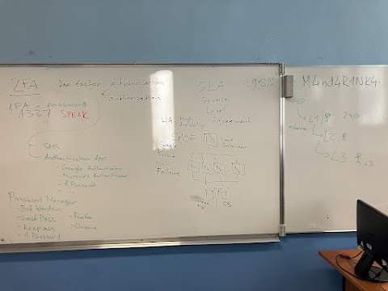

# Webové aplikace - hodina 19.1. 2024

Během první hodiny jsme se zabývali pololetní písemnou prací. Někteří pololetní práci teprve začínali, někteří ji upravovali a opravovali dle potřeby.

Ve druhé hodině jsme se učili o bezpečnosti na internetu. Konkrétně jsme brali **2FA** (2-factor authenticor) a **SLA** (Service Level Agreement). 

**2FA** *je autentizace, která posiluje zabezpečení přístupu. Konkrétně vyžaduje ověření identity.* 
**SLA** *je smlouva mezi poskytovatelem a zákazníkem.*

